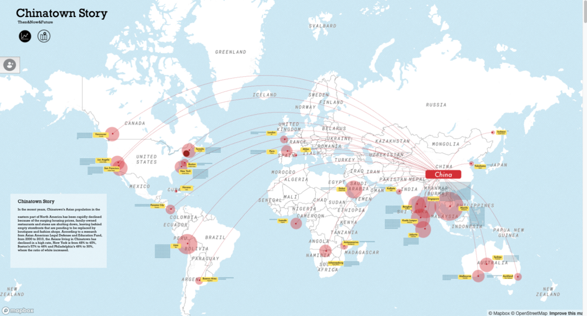

# Chinatown Story

> View the ChinaTown Story in [your browser](https://zy-zhu.github.io/Chinatown-Handbook/)

## Design Rationale
Through this project, we want to provide the users an opportunity to better know food industry of the Chinatown and its neighborhood near downtown Boston. At this point, we want to show some information that may be already available on Google or Yelp’s App, then add our own research and analysis of these dataset we are using。
1.	How did you choose your particular visual encodings, interaction, and animation techniques? 

We use [Leaflet.js](https://leafletjs.com/) and [Mapbox API](https://www.mapbox.com/) to embody the coordinates onto a web-based map. We were to give a general impression of Chinatowns all over the world then move to our focus on Boston Area. The map can also be altered from 2D top view to a 3D perspective view, through slide down from upper pages to lower pages, with our re-designed template for visual style. We added filters like Price, Rating, Cuisine Code and Credit Score, to let user decide which markers to show up according to their purpose or demand. Lastly, we have an analytic chart/graph, created by [d3.js](https://github.com/d3/d3/wiki/Gallery), to show the discrete point that represent each company mainly based on their customers’ rating and the number of viewers(customers), but also include other information that related to the companies themselves.

2.	What alternatives did you consider and how did you arrive at your ultimate choices?

One design about the interactive map is that we were considering weather use popup windows to show the detailed information when the user’s mouse hover on a marker, while, we eventually choose to use the side panel to present these information by user clicking the marker. We believe in this way the layout is more user friendly and the panel would not just disappear if they want to point on the information in the panel 

##Project Group
Illustration & Storytelling: Zoey-Ziyuan Zhu

Website: Zoey-Ziyuan Zhu

D3.js: Litao Yan

Location Selection: Kaihong Gao

